<html xmlns="http://www.w3.org/1999/xhtml">
<head>
 <title>
  MathematicaLectureNotebook1 (the Wolfram Language for Students - Personal Use Only : www.wolfram.com)
 </title>
 <link href="HTMLFiles/MathematicaLectureNotebook1.css" rel="stylesheet" type="text/css" />
 
</head>

<body>

 
 

 The notebook interface

 Very similar to Jupyter notebooks

 Enter code/expressions in a cell

 Shift-return (or enter on the numeric keypad) evaluates the expression

 The output is shown below the input cell

 

 

 

 

 Simple arithmetic

 The usual operations work:

 

 

 Note: division of integers gives rational numbers not floating point:

 

 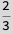

 Numbers with decimal points are interpreted as inexact (i.e. double precision floating point)

 

 

 Group expressions using parentheses. Multiplication can be perform by adding a space (a gray x will appear):

 

 

 

 

 

 More computations

 There are a huge number of mathematical functions built in:

 

 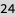

 Sin, Cos, Log, Exp, Gamma, Erf

 Note:

 All built-ins in Mathematica begin with a capital letter

 Even constants, e.g. Pi, E, and I

 This leaves all lowercase-beginning identifiers for user code

 

 Function call syntax

 Unlike in Julia, functions are called with square brackets

 Examples:

 

 

 

 

 

 

 As in Julia, arguments are separated by commas:

 

 

 

 Variables and expressions

 Here we begin to see what makes Mathematica different

 Unlike in Julia, variables may be used before they are assigned a value

 Mathematica will manipulate the expression with variables held in an unevaluated form

 

 

 

 

 

 Mathematical expressions

 Using variables in this way lets us manipulate mathematical objects such as equations and polynomials

 Note: using some shortcuts, you can use &ldquo;fancy&rdquo; notation in input cells (e.g. superscripts for powers, fractions for division, etc.)

 

 

 

 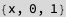

 

 Plotting

 Expressions defining functions in one variable can be plotted:

 

 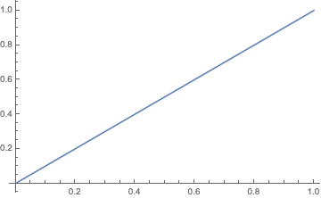

 The syntax {x,0,1} defines a list (similar to an array in Julia). Lists can contain anything, and can be arbitrarily nested

 

 

 We will see later how to access and manipulate lists. For now we will just use simple lists to define the axes.

 

 More plotting

 The plotting and visualization functionality of Mathematica is very advanced You can read the built-in documentation to learn more Some examples:

 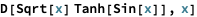

 

 

 

 

 Using Mathematica for calculus

 Mathematica is what Wolfram Alpha is based on&#8232;(You may be familiar from Math 1A...)

 There is very powerful built-in differentiation and integration of expressions:

 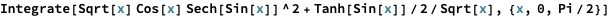

 

 Integrate can be used to compute indefinite integrals

 

 

 Providing bounds of integration in the form of a list (just like in plotting) can be used to compute definite integrals

 

 

 Numerical (approximate results) can be obtained using the N function

 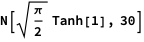

 

 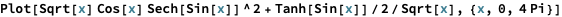

 

 If we want to be fancy, we can use mathematical notation in our code:

 

 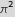

 

 

 

 Creating and assigning variables

 Variables are assigned using the equal sign = (Set)

 lhs = rhs

 will evaluate the expression &lsquo;rhs&rsquo; and assign the result to &lsquo;lhs&rsquo;. The right-hand side can be any Mathematica expression

 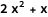

 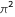

 

 

 

 

 Variables can be unset using Clear

 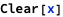

 

 

 

 Lists

 As we saw, lists can be created using braces

 

 

 We can perform arithmetic operations on lists

 

 

 

 

 The entries of a list are accessed using double-brackets (or the special notation [[ ]]) The entries are indexed starting with one

 

 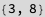

 

 

 We can also index a list using a list

 

 

 Lists can be mutated this way

 

 

 

 

 

 Recall

 There are four kinds of bracketing in Mathematica:

 (Parentheses) for grouping mathematical expressions

 

 

 

 

 [Square brackets] for functions calls

 

 

 {Braces} for lists

 

 

 [[Double brackets]] for indexing

 

 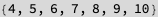

 

 Creating Lists

 Simple ranges can be constructed using Range

 

 

 

 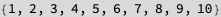

 

 

 Much more flexible is Table, which allows for the creation of lists using expressions

 

 

 

 

 

 

 Table can also be used to create matrices (which are represnted as lists of lists)

 

 

 Matrices can be displayed nicely using MatrixForm

 

 

 Note: functions can also be evaluated using postfix notation with the // operator

 

 

 

 Interactivity

 One of Mathematica&rsquo;s most powerful features is its interactivity

 Consider plotting a set of parabolas

 

 parameterized by the value a

 We begin by choosing a &ldquo;representative&rdquo; set

 

 

 Plotting these functions gives us some insight

 

 

 More useful is manipulating the parameter interactively

 

 

 We can use manipulate to understand e.g. frequency and amplitude of waves

 

 

 

 Algebraic manipulation and simplification

 This is one of the most powerful features of Mathematica

 

 

 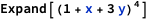

 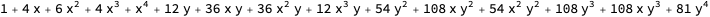

 In particular, Simplify is one of the most useful single functions

 

 

 Sometimes FullSimplify can simplify more complicated expressions (using an expanded set of rules)

 

 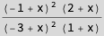

 

 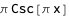

 

 

 

 

 The percent symbol can be used as a shortcut for the output of the last expression

 

 

 

 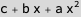

 

 

 

 Substitution rules

 Given an expression such as:

 

 

 We can evaluate this expression with the variables replaced by numbers (or any other expressions) using substitution rules

 The replacement operator is typed slash-dot, and rules are typed -&gt;

 

 

 Multiple substitutions can be made at once using lists of rules

 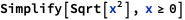

 

 

 More algebraic manipulations

 Simplify tends not to make assumptions about the variables

 

 

 Assumptions can be provided as a second argument to Simplify:

 

 

 Algebraic expressions can be analyzed programmatically:

 

 

 

 

 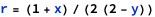

 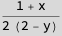

 

 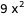

 

 

 

 

 

 

 

 

 Example: binomial theorem

 Recall the binomial theorem:

 

 Mathematica immediately simplifies using this identity:

 

 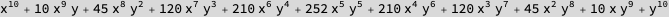

 We can evaluate for a specific n using a replacement rule

 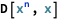

 

 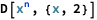

 

 

 More calculus and series

 Mathematica can easily compute partial and repeated derivatives

 

 

 

 

 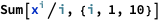

 

 

 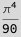

 Finite and infinite sums can be computed using Sum

 

 

 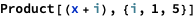

 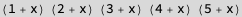

 

 

 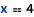

 

 

 Equations

 Just like in Julia, equality is tested with ==

 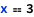

 

 

 

 

 

 

 Equations are themselves Mathematica expressions

 

 

 Equations can be solved using Solve

 

 

 

 

 

 

 NSolve (for &ldquo;numeric solve&rdquo;) will look for numeric rather than symbolic solutions

 

 

 For linear, quadratic, cubic, and quartic polynomials, Mathematica will always give a closed-form solution

 

 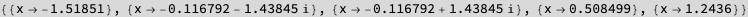

 Some equations do not admit closed-form solutions

 

 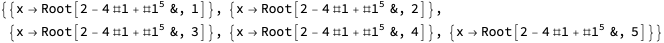

 

 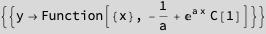

 You can also solve for simultaneous systems of equations

 

 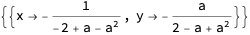

 

 Differential equations

 Mathematica can find analytical solutions to many differential equations, both initial value problems and boundary value problems

 The function DSolve looks for solutions to differential equations

 

 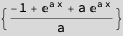

 We did not specify an initial condition, so the solution has a constant. Specifying the initial condition eliminates the constant

 

 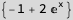

 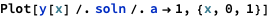

 

 

 

 

 

 We can solve a boundary value problem:

 

 

 

 

 

 Set and SetDelayed

 Up until now, we have assigned expressions to variables using =, which is called Set

 Whenever we write lhs = rhs, the rhs is evaluated immediately

 Sometimes we don&rsquo;t want to evaluate the rhs immediately. Instead, we want to wait until we encounter lhs somewhere else in our program. When we encounter lhs, it is replaced by rhs and only then evaluated

 This is denoted SetDelayed, and is written :=

 For example, we will use Set for x, and SetDelayed for y

 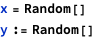

 

 

 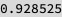

 

 

 

 

 

 

 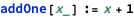

 

 

 

 

 Defining functions

 Functions are just another type of expression in Mathematica

 Their argument lists take the form of patterns. We will discuss patterns in more depth in the next lecture

 For now, we will make use of one kind of pattern: x_ which matches any expression and calls it x. For example:

 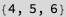

 This function can be called with any kind of argument. That argument will be called x in the body of the function, which gives a result by adding one

 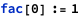

 

 

 

 There are much more sophisticated patterns than just &ldquo;match any expression.&rdquo; We will cover these later.

 Suppose we want to recursively compute the factorial Base case: fac(0) = 1 Recursive definition: fac(n) = n*fac(n-1)

 This is simple to define in Mathematica. We begin with the base case

 

 Now, fac[0] will evaluate to 1

 

 

 We don&rsquo;t have a rule for the general case, so fac[n] will remain unevaluated:

 

 

 Defining the general case:

 

 

 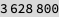

 

 

 

 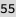

 Let&rsquo;s do a similar exercise with the Fibonacci sequence: 

 

 

 

 Of course, Mathematica also has this built in, so we can check our work...

 

 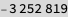

 

 Solving recurrence relations

 Suppose we have the recurrence relation

 

 We can easily create a function to recursively evaluate this sequence

 

 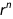

 

 What if we want to know a general (non-recursive formula)? First, concentrate on the recursive definition 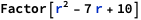 (ignoring boundary conditions) We can solve this recurrence by making the ansatz that is given by  for some r In that case,

 

 So, we look for solutions to this equation.

 

 

 So, <em>r</em><em>=</em><em>5</em> and <em>r</em><em>=</em><em>2</em> satisfy this relationship. The general solution will be given by 

 We can easily solve the system of equations to find the values of c and d. But we can also let Mathematica help...

 

 

 

 

 

 

 Let&rsquo;s check our formula

 

 

 

 

 ClearAll deletes all the definitions we made for a

 

 Mathematica can also solve the recurrence directly using RSolve

 

 

 

 More complicated functions and local variables

 Sometimes we want to introduce local variables in a function for intermediate values in long calculations

 This can be achieved using Module

 

 

 

 

 

 

 Mathematica also has other scoping mechanisms (i.e. for creating variables with local scope) See e.g. Block, With

 For our uses, Module is sufficient

 

 Functional style programming

 Mathematica is a multi-paradigm programming language

 It supports both functional and imperative programming, but functional constructs are often very natural

 For example, applying a function f to a list is known as mapping f over the list

 

 

 

 

 Map is considered so important in Mathematica it has its own syntax

 

 

 We can define more complicated functions if we want

 

 

 

 Sometimes we want to create an anonymous function so that we don&rsquo;t need to name it

 

 

 Here # indicates the argument, and &amp; tells Mathematica that the preceding expression is a function

 This notation can easily become hard to read, so be careful

 

 

 

 More functional programming

 Recall our list

 

 

 We can apply filters to the list using Select

 

 

 We can combine this with anonymous functions

 

 

 Sometimes we want to apply a function to a list for its side-effect rather than its return-value

 For this we have Scan

 

 

 

 

 

 

 

 

 

 

 

 There are a ton more functional programming facilities in Mathematica

 See e.g. Nest, Fold, Apply

 

 

 Can we get the sum of all of these entries?

 

 

 

 

 

 

 

 

 

 

 

 Procedural control flow

 Mathematica also has procedural control flow (perhaps more familiar from e.g. Julia)

 

 

 

 Which can be used for many if-else clauses

 

 

 The simplest loop is the Do loop, which repeats the contents n times

 

 

 

 

 

 

 

 

 

 

 

 We also have traditional for loops

 

 

 

 

 

 

 

 

 

 

 

 

 

 

 

 

 

 

 

 

 

 

 Application: merge sort

 Merge sort is a recursive algorithm Given a list, we: 1. find a midpoint 2. split the list at its midpoint into a left list and right list 3. sort the left and right lists using merge sort (recursion) 4. merge the two lists

 

 

 

 

 

 

 The runtime complexity of merge sort is given by the recurrence t(n)=2t(n/2)+O(n)

 

 

 The runtime complexity is n log(n)

 

 Functional-style merge sort

 

 

 

 

 Finding all primes less than n

 Algorithm known as the Sieve of Eratosthenes

 Choose a number n We will find all primes less than n 1. List all numbers 2 through n 2. Starting with, p=2, mark all multiples of p, beginning with  &nbsp;&nbsp;&nbsp;&nbsp;i.e. mark  up to n 3. Repeat step 2 with p the next unmarked number 4. Terminate when 

 

 

 

 Let&rsquo;s check our work...

 

 

 We can also use a functional approach

 

 

 

 

 Graph algorithms

 There is sophisticated built-in support for graphs and graph algorithms

 There are lots of built-in graphs obtainable using GraphData, e.g.

 

 
<map name="map_392">
<area shape="rect" coords="13,136,71,126" title="Dynamic[FEPrivate`FrontEndResource[FEStrings, sizeExplanation]]" nohref="" />
</map>

 

 

 

 

 Let&rsquo;s perform a depth-first search on this tree

 We start with the root node (33) in our case, and visit each node in the graph by first visiting all the children of a given node before visiting any of its siblings

 

 We will need to find the neighbors of a given node:

 

 

 We also don&rsquo;t want to visit our parent, so we will use Cases and Except to skip items

 

 

 

 

 

 

 

 

 

 

 

 

 

 

 

 

 

 

 

 

 

 

 

 

 

 

 

 

 

 

 

 

 

 

 

 

 

 

 

 

 

 

 

 

 

 

 

 

 

 

 

 

 

 

 

 

 

 

 

 

 

 

 

 

 

 

 

 

 

 

 

 

 

 

 

 

 

 

 

 

 

 

 

 

 

 

 

 

 

 

 

 

 

 

 

 

 

 

 

 

 

 

 

 

 

 

 

 

 

 

 

 

 

 

 

 

 

 

 

 <a href="http://www.wolfram.com/language/" style="color:#000; text-decoration:none;">
  Created with the Wolfram Language 
 </a>

</body>

</html>